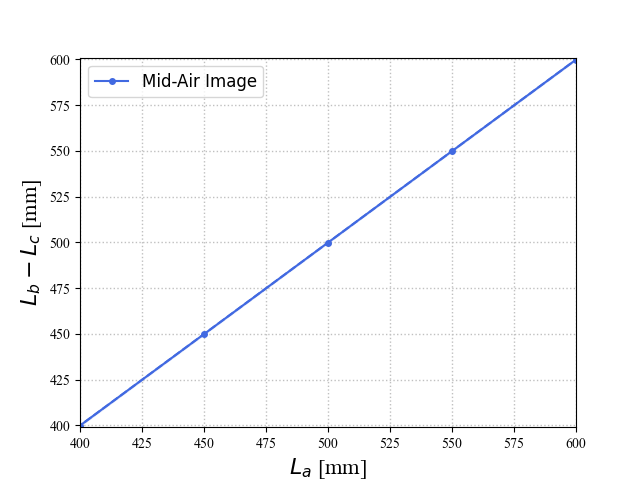
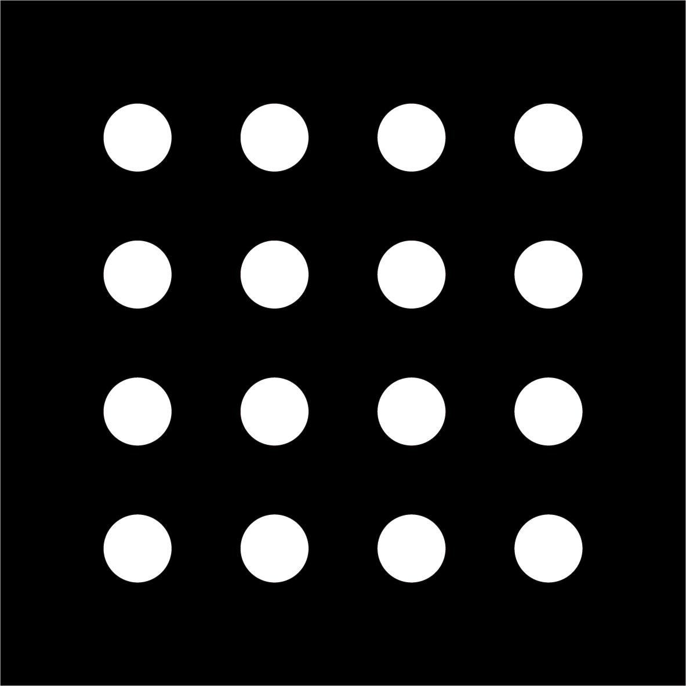

# レンダリング画像に対してステレオマッチをする

空中像光学素子の設計をBlender等のレイトレーシングを用いて実施する研究を行なっています（例えば[Sano 2025](https://link.springer.com/article/10.1007/s10043-025-00948-1)）。光源と空中像光学素子を置いてレンダリングした画像に対して画像処理を用いて空中像の評価を行っているのですが、レンダリングした画像が空中像なのか、別の像なのかを2次元画像では判断しにくいものです。そこでその判断するために、CG画像を複数枚レンダリングし、その画像から像の位置を計測することで、光学素子から像の飛び出し距離を算出しています。

本稿では、その時に利用するステレオマッチングの手続きに関して記載しています。[MMAPsによる空中像生成をBlenderで再現](https://www.media.lab.uec.ac.jp/?p=2569)を参考にしつつ、このページの内容を活用して、空中像光学系の研究に取り組んで下さる人がいれば幸いです。

# ステレオマッチングとは

- 左右2か所から撮影した画像の差分を計算することで、カメラと撮影対象の間の距離を求める方法です。
- 以下に記載のプログラムでできること
    - 光源-光学素子間の距離（ $L_a$ ）を変化させたときに、空中像飛び出し距離（＝光学素子-空中像間距離, $L_b - L_c$）がどれくらい変化するのかを求めます。
        - 空中像を左右2か所から撮影し、ステレオマッチによって差分画像からカメラ-空中像間距離（ $L_c$ ）を計算します。
        
        
        
        
        
        - 横軸：光源-光学素子間の距離
        - 縦軸：空中像飛び出し距離（＝光学素子-空中像間距離）
        - $y=x$ の式になっていれば、空中像が光学素子を対称の面として光源と面対称な位置に結像していることが示されます。

# レンダリング前に知っておくべきこと

- 光源画像（空中像として表示する画像）は、白丸が平面に縦4 x 横4個並んだ画像を使用します。
    - 画像を使ってもいいですし（例えば以下）、Blender上に光る白丸を16個並べても良いです。寸法は何でもいいです。
        
        
        
- レンダリング結果の保存先・ファイル名は「`render/{LまたはR}/{4桁整数値}.png`」とします。
    - `LまたはR`：左側カメラの画像は「L」、右側カメラの画像は「R」に保存します。
    - `4桁整数値`：空中像飛び出し距離（厳密には光学素子と光源の間の距離）を4桁の整数値として表します。
- 迷光や透過光、光源からの直接光が映ると、正しく判定できなくなります。
    - 迷光や透過光の点が空中像の16点より下に来るようにすれば、迷光や透過光がレンダリングされていても正しく判定できます。下記に記載のプログラムが、左上から右下に向けて16個の丸を検出し、それ以降は無視する仕様になっているためです。

# ステレオマッチング用画像のレンダリング (Blender)

- 光源-光学素子間の距離を変化させたときの空中像画像を、左右2か所のカメラから撮影します。
- 以下のいずれかの方法がおすすめです。

## Animation を使う

- さっくりノーコードでパパっとやりたいときにおすすめです。
- どんな方法？
    - Blender のアニメーション機能で、ディスプレイが少しずつ光源から離れていくようなアニメーションを作成し、Render Animation する方法です。

        https://github.com/user-attachments/assets/6c15d725-4a2a-49b9-afaf-3f31bf886201

 
        
- サンプルファイル
    
    [stereo_sample.blend](Sample_Blender/stereo_sample.blend)
    
    - 光源 - MMAP 間距離が 40 cm から 60 cm まで1フレーム当たり 1 cm ずつ変化するアニメーションが適用されています。
    - `Render Animation` すると、片側のカメラの画像が指定したフォルダに出力されます。
        - Frame Range の Step 数をいじることで、何センチメートル置きの画像をレンダリングできるかを設定できます。
    - 片側のカメラ分の画像しか出力されないので、左右のカメラを切り替えて再度レンダリングします。
        - そのとき保存先を変えないと、先にレンダリングした画像が上書きされてしまうので、出力先フォルダの変更を忘れないようにしましょう。
    - 上記ファイルの「Set_parameters」の Collection 以下をコピペして自分のプロジェクトで使っても問題ありません。
- 自分でアニメーションを作るときのメモ
    - Interpolation Mode を Linear にすると、キーフレーム間の移動が等間隔になり、計算しやすくなります。
        
        
        
        - キーフレームを右クリック

## Python スクリプトでレンダリング

- がっつりレンダリングしたいときにおすすめです。
- どんな方法？
    - Python スクリプトでレンダリングまで処理します。

      
        
        
- サンプルファイル
    
    [stereo_sample_code.blend](Sample_Blender/stereo_sample_code.blend)
    
    - 光源 - MMAP 間距離が 40 cm から 60 cm まで 5 cm 刻みでレンダリングします。
    - `Run Script` すると、レンダリング結果が指定したフォルダに出力されます。
        - レンダリング中は Blender がフリーズ状態になります。レンダリングに時間がかかっているのか、それともプログラムのどこかでフリーズ状態になっているのかの判断が難しいのが欠点です。
    - 上記ファイルのプログラム中の「dirName」に保存先パスを記載しますが、このパスはBlender実行元からの相対パスなので注意してください。

# ステレオマッチングの Python コードと使い方

## 使用するファイル類

[requirements.txt](requirements.txt)
- Python のモジュールインストール用

[CalcStereo.py](CalcStereo.py)
- ステレオマッチ本体のプログラム

## ファイルの配置

- ファイル構造を以下のようにします。（レンダリング結果のフォルダ名などが異なっていても指定はできますが、以下のようにしておくと楽です）
    
    ```
    ├─何かしらのフォルダ
    │  │  CalcStereo.py --- 上記のプログラムをここに配置
    │  │
    │  └─render
    │      ├─L
    │      │      ここに左側カメラの画像を「xxxx.png」で保存（xxxxは空中像飛び出し距離）
    │      │      00xx.png
    │      │
    │      └─R
    │             ここに右側カメラの画像を「xxxx.png」で保存（xxxxは空中像飛び出し距離）
    │             00xx.png
    ```
    
    - `CalcStereo.py` を配置したフォルダに「render」というサブフォルダを作成し、その下の「L」「R」のサブフォルダにそれぞれ左側・右側カメラの画像を配置します

## パラメータの設定

- カメラ配置の設定：Blender などのシミュレーション時の設定を反映する
    
    
    
    - `side`：左右カメラ間の距離（瞳孔間距離）の半分の値を設定します。左右のカメラを 5 cm 離して配置したなら、2.5 cm と設定します。
    - `dist`：MMAPなどの光学素子とカメラの間の距離を設定します。
    - `focal_length`：カメラの焦点距離を設定します。
    - `diagonal`：イメージセンササイズを設定します。フルサイズセンサーなら 3.6 cm に設定します。
- 画像処理のパラメータの設定：うまくステレオマッチングできなかった時に変更します。
    
    

    - `ikichi`：空中像画像を二値化処理するときの閾値です。
    - `kernel`：空中像画像をフィルタリングする時のカーネルサイズです。
- ファイル入出力関係の設定
    
    
    
    - `folderBase`：入力画像のフォルダを指定します。コマンドライン引数からでも指定できます。
    - `folderAns`：ステレオマッチング結果の出力フォルダを指定します。コマンドライン引数からでも指定できます。
    - `extension`：ファイルの拡張子を指定します。

## ステレオマッチングの実行

- `CalcStereo.py` が保存してあるフォルダから、このプログラムを実行するだけです。
    
    

    - （追記）Windows PowerShellで実行する場合、コマンドは”python”ではなく、”py”にしてください。
    - 引数の指定もできます
        
        ```
        引数0つ
        ・上記のフォルダ名がデフォルトで指定される
        引数2つ
        ・第1引数：入力画像フォルダ（フォルダ名の最後に「/」を忘れずに）
        ・第2引数：出力画像フォルダ（フォルダ名の最後に「/」を忘れずに）
        引数3つ
        ・第3引数：二値化処理時の閾値
        引数4つ
        ・第4引数：カーネルサイズ（整数値1つ）
        ```
        
    - `no module named …` のエラーが出たら、`pip install` でそのモジュールをインストールしてください。
        - `pip install pandas` や `pip install imgio` など。python の実行環境を指定するなら`python3 -m pip install …` も。
        - 上記`requirements.txt` を使うと楽です
- 問題なく終わると、`result` フォルダの中に結果が出力されます。
    - `reslCSV`：結果のCSVファイルが保存されます。Excel などで処理したいときに便利です。
    - `reslIMG`：結果のグラフが出力されます。
        
        
        
    - `resStereo`：フィルタリング・二値化後の画像が出力されます。うまくステレオマッチングできなかった（白丸の位置を検出できなかった）ときはこれを確認し、上記「画像処理のパラメータの設定」でパラメータを変更します。
